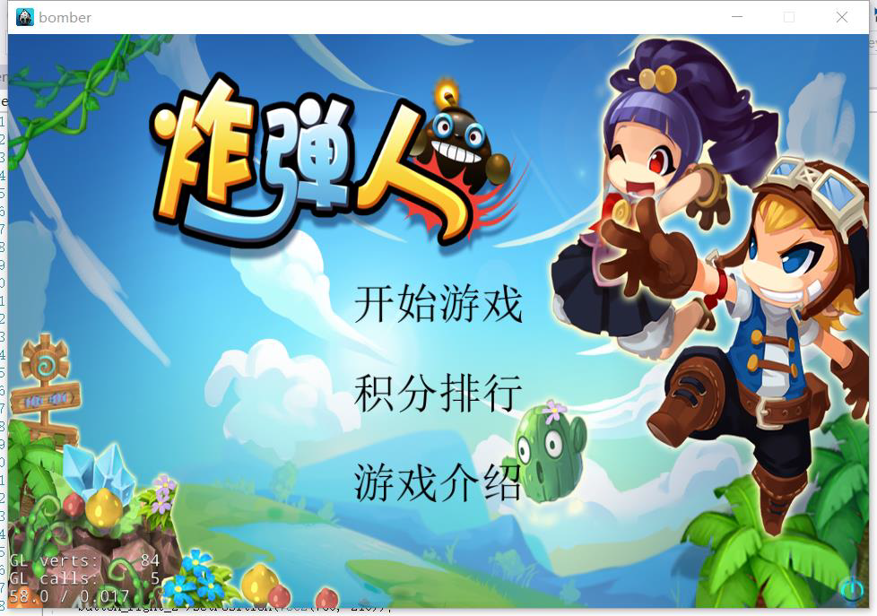
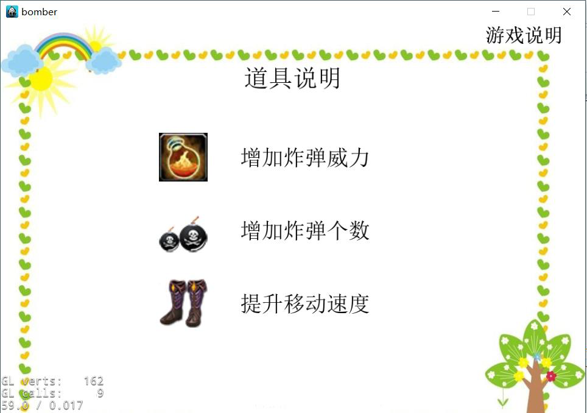
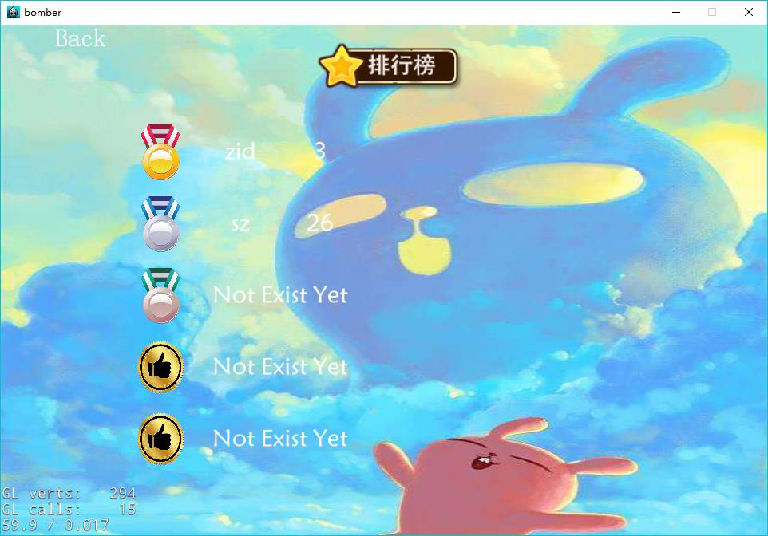
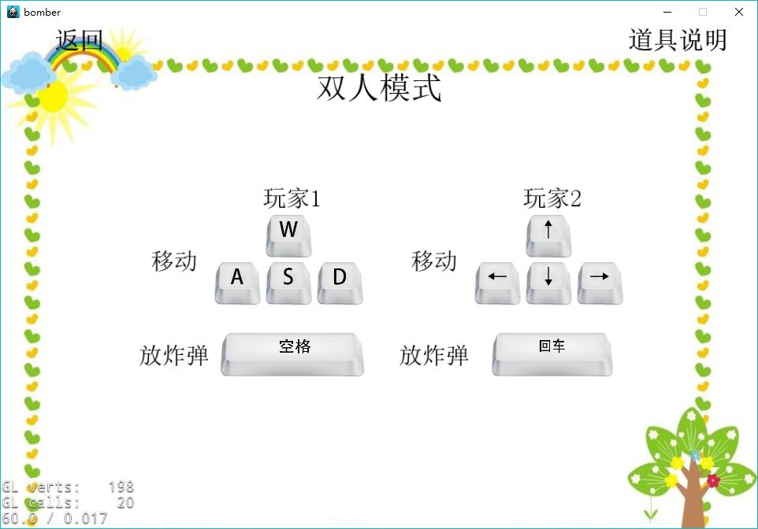
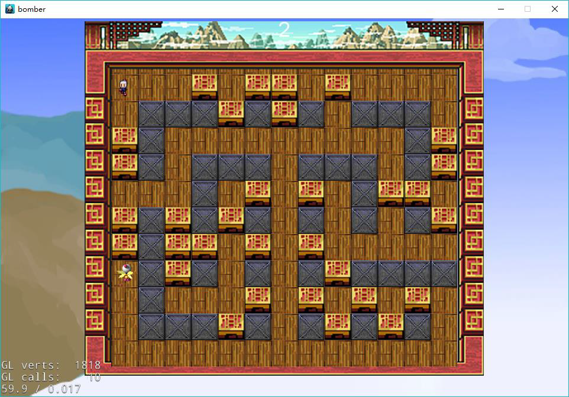
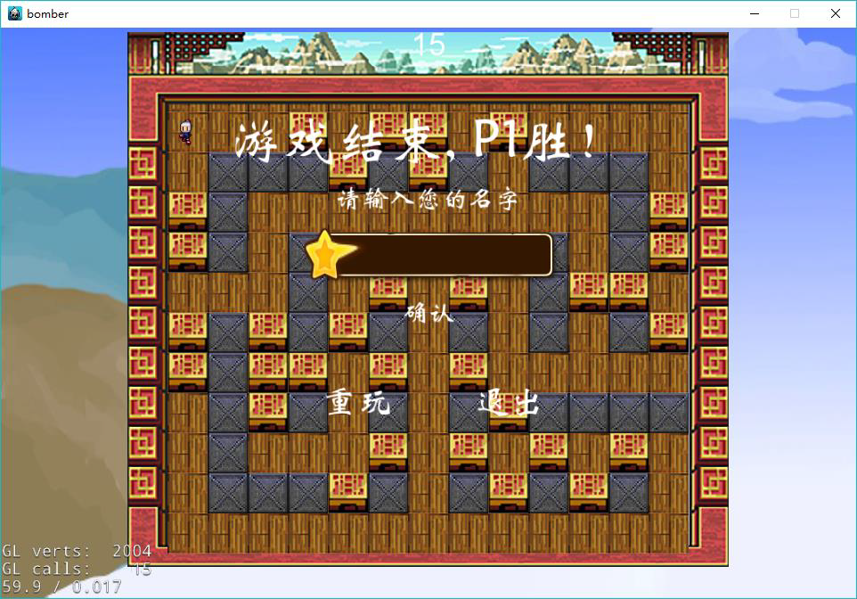

# 炸弹人

这是一款基于cocos2d-x游戏引擎的双人对战小游戏，通过灵活移动躲避对方攻击，有效利用箱子来获得道具，并合理放置炸弹，来打败对方，从而获得胜利。通过计时长短，来判断分数的高低。在游戏主菜单上我们设置了三个可待进入的场景，分别是游戏界面，排行情况界面，以及游戏介绍界面。排行情况界面可以看到排行前五的排名，游戏介绍界面分别游戏说明和道具说明界面，游戏说明里面是游戏的操作按键，道具说明里面是道具的具体功能。

## 实现难点

我负责的部分中(地图和动画逻辑)

1. 爆炸动画的实现：
   1. 困难：爆炸动画具有多样性。我们有道具能增加炸弹的范围，所以炸弹的爆炸的最大长度是不定的；爆炸火焰也会被周围的墙壁和箱子所挡住，实际显示的爆炸火焰长度也是不定的；
   2. 解决：将爆炸的动画分为3个部分，爆炸的中心点动画，爆炸中心点到末端的中间动画，爆炸末端的动画，在爆炸时先将爆炸的上下左右四个方向的延伸长度（网格数）求出来，再在每一个网格上放置对应的爆炸动画。
2. 地图：
   1. 困难：一开始并没有构建地图，人物的移动和炸弹的范围都是实际的屏幕距离，导致了编程上的困难；
   2. 解决：构建地图将窗口分为细小的网格，位置和速度都的表示都以网格为单位，网格再通过函数转换成实际的屏幕距离，这一层抽象使得爆炸范围，人物位置不再连续，从而易于判断是否人物，箱子受到爆炸的影响，同时使得后面需要用到位置信息的函数实现变得简洁。

## 游戏界面

1. 游戏菜单

2. 道具说明

3. 积分排行榜

4. 操作说明

5. 游戏场景

6. 游戏结束

